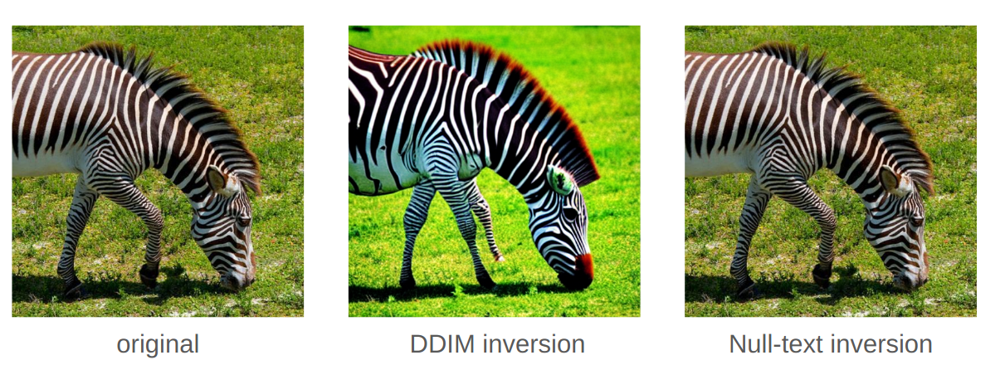

# Inversion for Generative Image Editing

__Aleksei Arzhantsev, Konstantin Amelichev__

Available on [github](https://github.com/aiarzhantsev/inversion_project).

## Usage

The notebook `main.py` needs enabled CUDA accelerator and runs from Google Colab / Kaggle Notebooks without any additional configuration. 